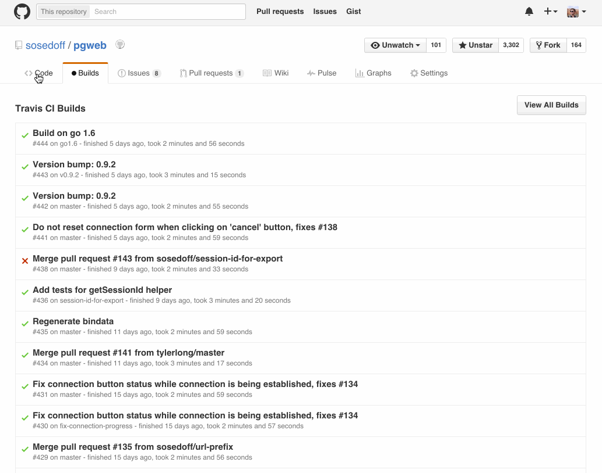

# Travis CI builds in Github

Chrome extension to add Travis CI builds tab to Github

## Install

Download from the [Chrome Store](https://chrome.google.com/webstore/detail/github-travis-ci-builds/dphnhapafaimelkockemokgfdocadbdo)

## Try

Try extension on any of the following repositories:

- https://github.com/twbs/bootstrap
- https://github.com/rails/rails
- https://github.com/docker/docker
- https://github.com/mitchellh/vagrant
- https://github.com/ansible/ansible

## Demo

